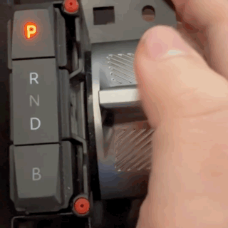
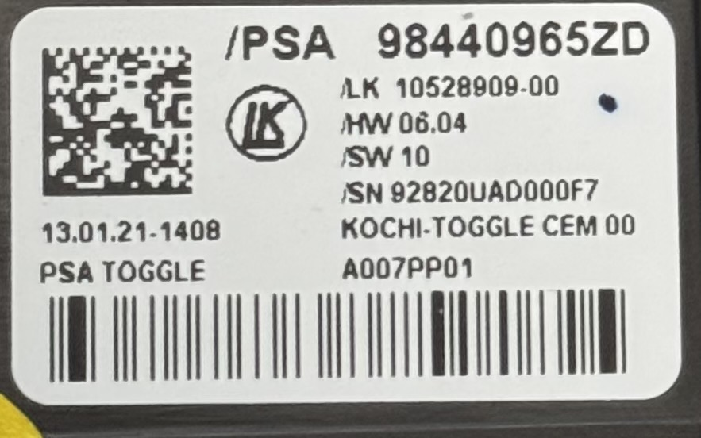

## PSA Toggle Arduino Code

This Arduino code talks to the widespread gear selector ("E-Toggle") PSA/Stellantis cars (Peugeot, Opel, Citroen, Jeep)


Part Number: `98440965ZD`


### CAN ID 0x219
Received by eToggle.
XX is the checksum+counter byte

| Payload | Meaning|
|---------|--------|
|`XX` `02` `00` `00` | P |
|`XX` `04` `00` `00` | P blink|
|`XX` `00` `01` `00` | D|
|`XX` `00` `02` `00` | D blink|
|`XX` `00` `08` `00` | N|
|`XX` `00` `10` `00` | N blink|
|`XX` `00` `40` `00` | R|
|`XX` `00` `80` `00` | R blink|
|`XX` `00` `00` `20` | B|
|`XX` `00` `00` `40` | B blink|

### CAN ID 0x259
Sent by eToggle
`XX` is the checksum+counter byte
`0000` stands for 16 bit unsigned integer (the following 2 bytes)

| Payload | Lever Position | Lever changed |
|---------|----------------|---------------|
|`0000` | Middle (N) | No |
|`6400` |D (1 notch) | Yes|
|`6000` |D (1 notch) | No|
|`8400` |D (2 notches) | Yes|
|`8000` |D (2 notches) | No|
|`2400` |R (1 notch) | Yes|
|`2000` |R (1 notch) | No|
|`4400` |R (2 notches) | Yes|
|`4000` |R (2 notches) | No
|`0040` |B pressed | No|
|`0100` |P pressed | No |

### Checksum algorithm
Reverse engineered
```C
byte checksumm_0E6(const byte *frame, uint8_t len, uint8_t iter, uint8_t seed)
{

  byte cursumm = 0;
  byte checksum = 0;
  for (byte i = 0; i < len; i++)
  {
    cursumm += (frame[i] >> 4) + (frame[i] & 0x0F);
  }
  cursumm += iter;
  cursumm = ((cursumm ^ 0xFF) - seed) & 0x0F;
  checksum = (cursumm << 4) | iter ;
  return checksum;
}
```